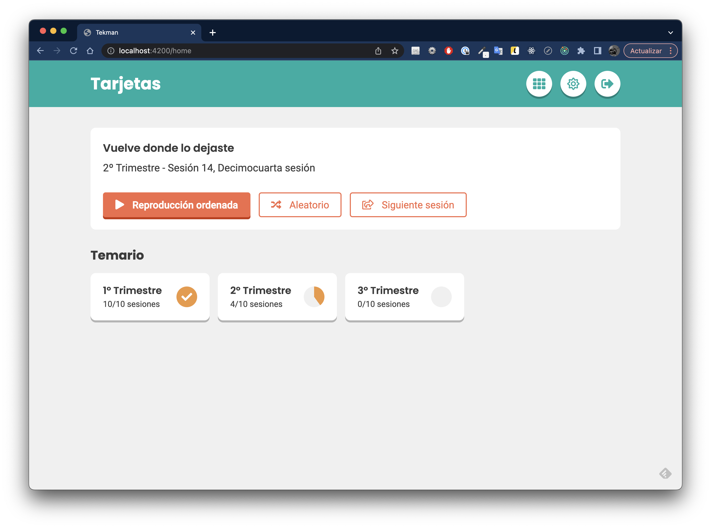

# Tekman

Prueba técnica para Tekman



## Herramientas usadas

Para realizar esta prueba se ha usado **Angular 14.2.11** con las siguientes librerías:
- @ngrx/store
- @ngrx/route-store
- @ngx-translate
- SASS (SCSS + BEM)
- Tailwind CSS (para agilizar los estilos de algunos componentes)
- Font Awesome Icons (paquete Fortawesome)

## Consideraciones

He optado por usar **@ngrx** por la facilidad que aporta a la hora de gestionar los estados, obivamente, para esta prueba era innecesario, pero he querido aportar algún valor extra.

El cambio de idioma es funcional, pudiendo cambiar de **Catalán** a **Castellano** mediante el selector que se encuentra en el sidebar de configuración presentado en Figma.

Los datos están en un objeto mock en **assets/data**

## Posibles bugs y otros

Algunos de los botones en la sección principal no funciona como lo esperado. O como yo entiendo que debería funcionar. Pero no he querido demorar más la entrega.

Desgraciadamente, no me ha sido posible realizar los Unit Test a los componentes por falta de tiempo... :(

## Instalación y arranque

1. Clonar el repositorio
2. Ejecutar el comando ```npm i``` para instalar todas las dependencias
3. Ejecutar el comando ```ng s``` para arrancar la aplicación


Gracias.